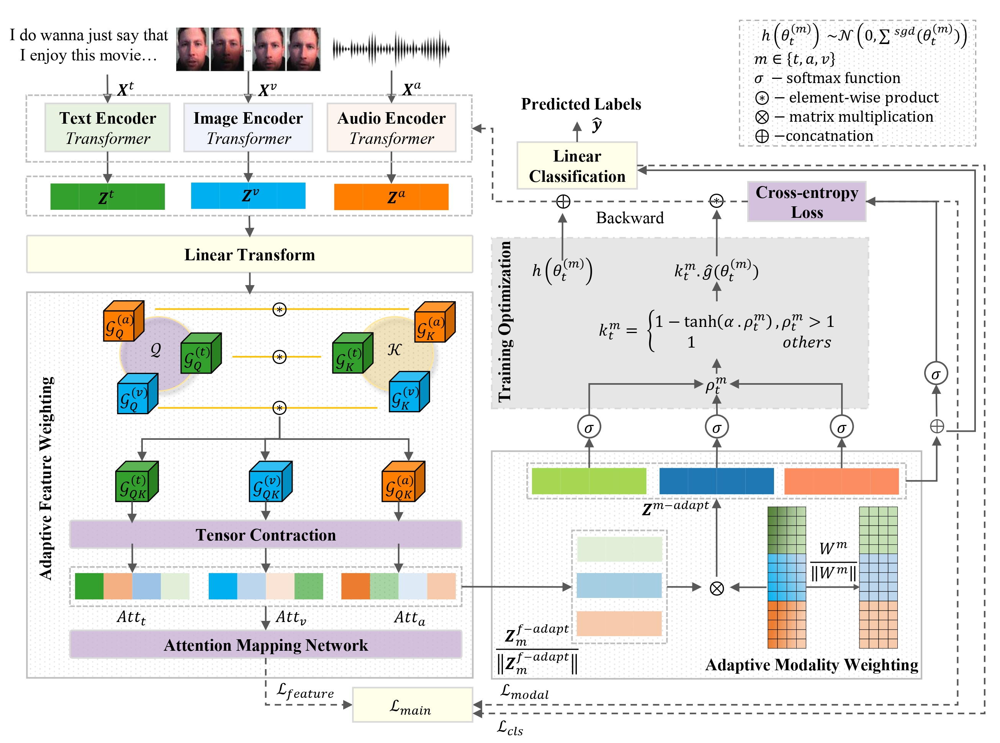

# Ada2I: Enhancing Modality Balance for Multimodal Conversational Emotion Recognition
Abstract:

Multimodal Emotion Recognition in Conversations (ERC) is a typical multimodal learning task in exploiting various data modalities concurrently. Prior studies on effective multimodal ERC encounter challenges in addressing modality imbalances and optimizing learning across modalities. Dealing with these problems, we present a novel framework named Ada2I, which consists of two inseparable modules namely Adaptive Feature Weighting (AFW) and Adaptive Modality Weighting (AMW) for feature-level and modality-level balancing respectively via leveraging both Inter- and Intra-modal interactions. Additionally, we introduce a refined disparity ratio as part of our training optimization strategy, a simple yet effective measure to assess the overall discrepancy of the model's learning process when handling multiple modalities simultaneously. Experimental results validate the effectiveness of Ada2I with state-of-the-art performance compared against baselines on three benchmark datasets including IEMOCAP, MELD, and CMU-MOSEI, particularly in addressing modality imbalances.

Architecture:

## Requirements
```
python==3.11.3
torch==2.1.0
comet-ml==3.35.3
```
### Installation
- [Comet.ml](https://www.comet.ml/docs/python-sdk/advanced/)
### Running
```
bash run.sh
```
